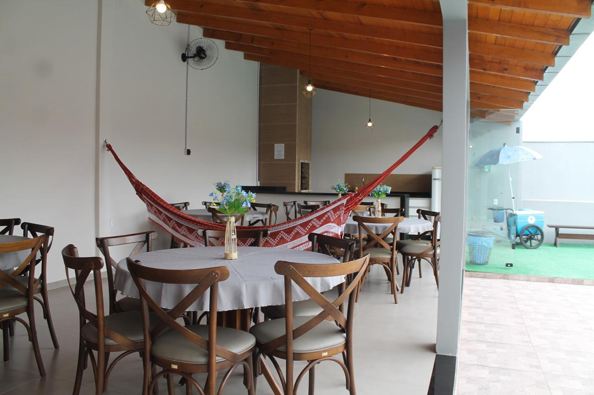

# Espaço Festa - Landing Page

Landing page institucional desenvolvida para o salão de eventos **Espaço Festa**, localizado em Mafra/SC. Esta página tem como objetivo apresentar o espaço, exibir fotos reais do ambiente, permitir o contato direto via WhatsApp e facilitar o acesso à localização via Google Maps.

---

## 📸 Demonstração

---

## 🚀 Tecnologias Utilizadas

- **HTML5**
- **Tailwind CSS (via CDN)**
- **JavaScript (básico, expansível)**
- **Google Maps Embed**
- **WhatsApp Direct API**

---

## 🧱 Estrutura de Pastas

espacofesta-landing/
├── index.html
├── README.md
├── assets/
│ ├── images/
│ └── logos/
├── css/
│ └── style.css
├── js/
└── main.js

---

## 🔗 Funcionalidades

- Galeria de imagens com layout responsivo
- Botão de contato direto via WhatsApp
- Link para o Instagram
- Mapa interativo do Google com a localização do espaço
- Design leve, responsivo e moderno com Tailwind

---

## 📱 Acesse

> *Você pode hospedar este projeto gratuitamente no [Vercel](https://vercel.com) ou [Netlify](https://netlify.com) e usar como portfólio ou página oficial do espaço.*

---

## ✍️ Autor

**Maciel Oliveira Costa**  
Desenvolvedor Front-End e Administrador  
📧 contato: maciel@email.com *(substituir)*  
📱 WhatsApp: [clique aqui](https://wa.me/5547999999999)

---

## 📌 Observações

- Este projeto foi construído como modelo de **portfólio profissional** e está disponível para adaptações para outros segmentos (restaurantes, salões, clínicas, etc).
- Futuras versões poderão incluir formulário de orçamento, depoimentos de clientes e galeria interativa com modal.

---
